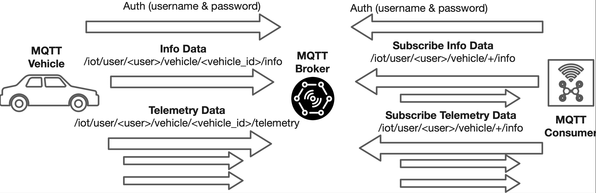
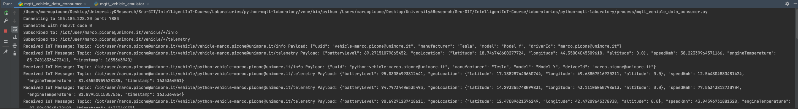
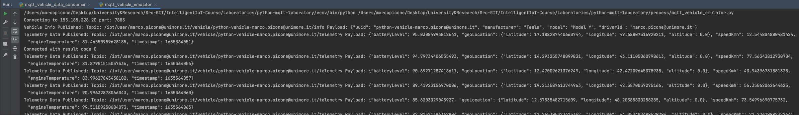

# Python - Laboratory MQTT

This project is associated to the MQTT Laboratory in order to design and create a simple MQTT application emulating 
an IoT scenario where multiple electric vehicles periodically publish telemetry information related to GPS location, 
speed and battery level. Furthermore, each vehicle at the startup publish a description (retained) message containing
information associated to its unique identification, manufacturer and model. An external consumer subscribe to receive
both telemetry and description messages from all the available vehicles.

The project use the Python Libray Paho that can be installed with the following command: 

```bash
pip install paho-mqtt==1.6.1
```

## Specifications


*Figure 1: Application scenario for monitoring connected electric vehicles via MQTT.*

The project’s goal is to create an IoT application scenario for monitoring electric vehicles using the MQTT protocol, as shown in Figure 1. The specifications for the components are as follows:

- The vehicle connected via MQTT represents the data producer, publishing vehicle information (`InfoData`) and telemetry information (`TelemetryData`) on dedicated topics.
- The topic for InfoData is `/iot/user/<user>/vehicle/<vehicle_id>/info`.
- The topic for TelemetryData is `/iot/user/<user>/vehicle/<vehicle_id>/telemetry`.
- Both topics refer to an authenticated broker with a base topic associated with a single user `/iot/user/<user>`. Replace `<user>` with your username to connect to the broker provided for the course.
- Upon connection, the vehicle publishes its InfoData messages as **retained** messages and sends TelemetryData every 3 seconds.
- The MQTT consumer subscribes to topics of interest to receive Info and Telemetry data for all registered vehicles using the following topics:
  - `/iot/user/<user>/vehicle/+/info`
  - `/iot/user/<user>/vehicle/+/telemetry`

An example JSON representation of the vehicle's InfoData:

```json
{
    "uuid": "vehicle-0001",
    "manufacturer": "Tesla",
    "model": "Model Y",
    "driverId": "driver00001"
}
```

An example JSON TelemetryData:

```json
{
    "geoLocation": {
        "latitude": 17.11294002770684,
        "longitude": 47.584728688577236,
        "altitude": 0.0
    },
    "batteryLevel": 98.96001084539103,
    "speedKmh": 77.04069775640971,
    "engineTemperature": 83.32024176635812,
    "timestamp": 1635339698884
}
```

## Project Creation & Dependencies

Create a new Python project with the following dependency:

- `paho-mqtt`: Eclipse Paho library for MQTT management.

## Model Classes

Create a folder named `model`, and within it, create a file named `geo_location.py` with the following class:

```python
import json

class GeoLocation:
    def __init__(self, latitude, longitude, altitude):
        self.latitude = latitude
        self.longitude = longitude
        self.altitude = altitude

    def to_json(self):
        return json.dumps(self, default=lambda o: o.__dict__)
```

In the same `model` package, create `vehicle_descriptor.py`:

```python
import json

class VehicleDescriptor:
    def __init__(self, uuid, manufacturer, model, driverId):
        self.uuid = uuid
        self.manufacturer = manufacturer
        self.model = model
        self.driverId = driverId

    def to_json(self):
        return json.dumps(self, default=lambda o: o.__dict__)
```

Following this, create `electric_vehicle_telemetry_data.py`:

```python
import json
import random
import time
from model.geo_location import GeoLocation

class ElectricVehicleTelemetryData:
    def __init__(self):
        self.batteryLevel = 100.0
        self.geoLocation = GeoLocation(0.0, 0.0, 0.0)
        self.speedKmh = 0.0
        self.engineTemperature = 0.0
        self.timestamp = int(time.time())

    def to_json(self):
        return json.dumps(self, default=lambda o: o.__dict__)

    def update_measurements(self):
        self.geoLocation = GeoLocation(
            10.0 + random.uniform(0.0, 10.0),
            40.0 + random.uniform(0.0, 10.0),
            0.0
        )
        self.engineTemperature = 80 + random.uniform(0.0, 20.0)
        self.batteryLevel -= random.uniform(0.0, 5.0)
        self.speedKmh = 10 + random.uniform(0.0, 80.0)
        self.timestamp = int(time.time())
```

## MQTT Vehicle Producer

Create a folder named `conf` and a file `mqtt_conf_params.py`:

```python
class MqttConfigurationParameters:
    BROKER_ADDRESS = "155.185.228.20"
    BROKER_PORT = 7883
    MQTT_USERNAME = "<your_username>"
    MQTT_PASSWORD = "<your_password>"
    MQTT_BASIC_TOPIC = f"/iot/user/{MQTT_USERNAME}"
    VEHICLE_TOPIC = "vehicle"
    VEHICLE_TELEMETRY_TOPIC = "telemetry"
    VEHICLE_INFO_TOPIC = "info"
```

Create a folder `process` and a new file `mqtt_vehicle_emulator.py`:

```python
import paho.mqtt.client as mqtt
import time
from model.vehicle_descriptor import VehicleDescriptor
from model.electric_vehicle_telemetry_data import ElectricVehicleTelemetryData
from conf.mqtt_conf_params import MqttConfigurationParameters

def on_connect(client, userdata, flags, rc):
    print("Connected with result code " + str(rc))

def publish_telemetry_data():
    topic = f"{MqttConfigurationParameters.MQTT_BASIC_TOPIC}/vehicle/{vehicle_id}/telemetry"
    mqtt_client.publish(topic, electric_vehicle_telemetry_data.to_json(), 0, False)
    print(f"Telemetry Data Published to {topic}")

def publish_device_info():
    topic = f"{MqttConfigurationParameters.MQTT_BASIC_TOPIC}/vehicle/{vehicle_descriptor.uuid}/info"
    mqtt_client.publish(topic, vehicle_descriptor.to_json(), 0, True)
    print(f"Vehicle Info Published to {topic}")

vehicle_id = "python-vehicle-{0}".format(MqttConfigurationParameters.MQTT_USERNAME)
mqtt_client = mqtt.Client(vehicle_id)
mqtt_client.on_connect = on_connect
mqtt_client.username_pw_set(MqttConfigurationParameters.MQTT_USERNAME, MqttConfigurationParameters.MQTT_PASSWORD)
mqtt_client.connect(MqttConfigurationParameters.BROKER_ADDRESS, MqttConfigurationParameters.BROKER_PORT)
mqtt_client.loop_start()

vehicle_descriptor = VehicleDescriptor(vehicle_id, "Tesla", "Model Y", MqttConfigurationParameters.MQTT_USERNAME)
electric_vehicle_telemetry_data = ElectricVehicleTelemetryData()
publish_device_info()

for _ in range(1000):
    electric_vehicle_telemetry_data.update_measurements()
    publish_telemetry_data()
    time.sleep(3)

mqtt_client.loop_stop()
```

## MQTT Consumer

In the `process` folder, create a new file named `mqtt_vehicle_data_consumer.py`:

```python
import paho.mqtt.client as mqtt
from conf.mqtt_conf_params import MqttConfigurationParameters

def on_connect(client, userdata, flags, rc):
    info_topic = f"{MqttConfigurationParameters.MQTT_BASIC_TOPIC}/vehicle/+/info"
    telemetry_topic = f"{MqttConfigurationParameters.MQTT_BASIC_TOPIC}/vehicle/+/telemetry"
    mqtt_client.subscribe(info_topic)
    mqtt_client.subscribe(telemetry_topic)
    print("Subscribed to topics")

def on_message(client, userdata, message):
    print(f"Received message on {message.topic}: {message.payload.decode('utf-8')}")

mqtt_client = mqtt.Client("python-vehicle-consumer")
mqtt_client.on_connect = on_connect
mqtt_client.on_message = on_message
mqtt_client.username_pw_set(MqttConfigurationParameters.MQTT_USERNAME, MqttConfigurationParameters.MQTT_PASSWORD)
mqtt_client.connect(MqttConfigurationParameters.BROKER_ADDRESS, MqttConfigurationParameters.BROKER_PORT)
mqtt_client.loop_forever()
```

## Test Producer/Consumer

First, start the consumer, then the producer, to verify data exchange on the topics:


*Figure 2: Example of the MQTT Consumer receiving vehicle data.*


*Figure 3: Example of vehicle MQTT data producer.*